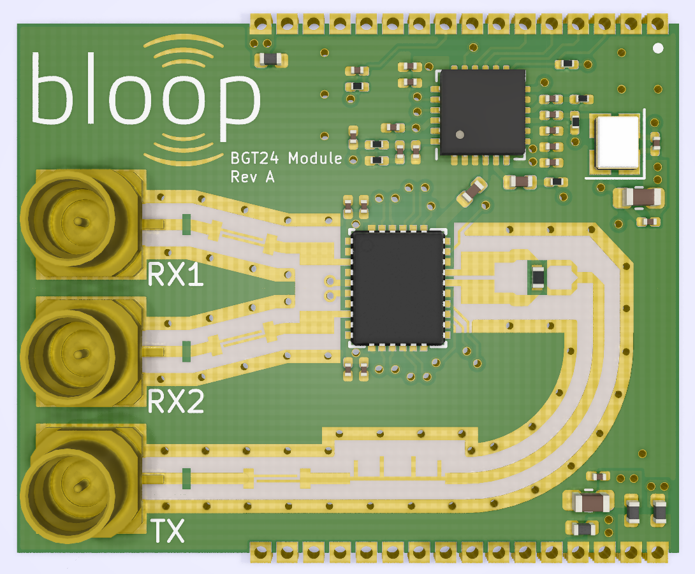

# Bloop Radar Platform

**Note: Hardware is still under heavy development. Please use at your own risk.**

## What is Bloop?
Bloop is an open-source 24 GHz radar platform aimed to be an easy way for hobbyists, students, and engineers to learn and experiment with radar. 

The goal for this project is not to make an application-specific radar but instead create a flexible platform to learn more about doppler and FMCW radar principles. In order to accomplish this the hardware must be low cost, modular, and allow people to develop their own applications easily. 

Currently, the software solution for Bloop is still unknown as the hardware is still being developed. The plan is to use the ECP5 as the FPGA for this platform and open-source FPGA toolchains available such as [Yosys](https://github.com/YosysHQ/yosys) and [nextpnr](https://github.com/YosysHQ/nextpnr).

## Hardware
The hardware will consist of three modules: an **antenna module** (work in progress), **RF module** ([BGT24 Module](#bgt24-module---rev-a)), and **digital module** (work in progress).

### Planned Hardware Specifications 
* 24 GHz Transceiver MMIC ([BGT24MTR12](https://www.infineon.com/cms/en/product/sensor/radar-image-sensors/radar-sensors/radar-sensors-for-consumer-and-iot/bgt24mtr12/?redirId=117670))
  * 1 TX SMP Connector
  * 2 RX SMP Connectors
* PLL with chirp generation ([LMX2491](http://www.ti.com/product/LMX2491))
* 4 Channel ADC ([ADAR7251](https://www.analog.com/en/products/adar7251.html#))
* ECP5 FPGA
* USB
* ... and more TBD

### BGT24 Module - Rev A
  

The BGT24 Module is the RF module for the Bloop radar platform, which provides differential I&Q data for RX1 and RX2 along with SPI and modulation control for the LMX2491 PLL and BGT24MTR12 RF transceiver. 

This module will continue to evolve as we test with the SPI Control prototyping hardware and develop some PCB antennas to test with.  

## Prototyping Hardware
Hardware found under `hardware/prototypes` is solely used to develop/evaluate the function of the RF section, BGT24 module, and the ADAR7251 ADC.

### SPI Control - Rev A
Work In Progress under branch `spi_control`  

The SPI Control hardware will include a USB-SPI controller for evaluating the BGT24 Module and ADC. The board will also include an external connector to interface with FPGA development boards.

### RF Front-End - Rev A
The RF Front-End is a panel of various RF microstrip structures to be evaluated for the RF section.

## License
Bloop hardware is distributed under the [Creative Commons Attribution Share Alike 4.0 International](LICENSE.txt)